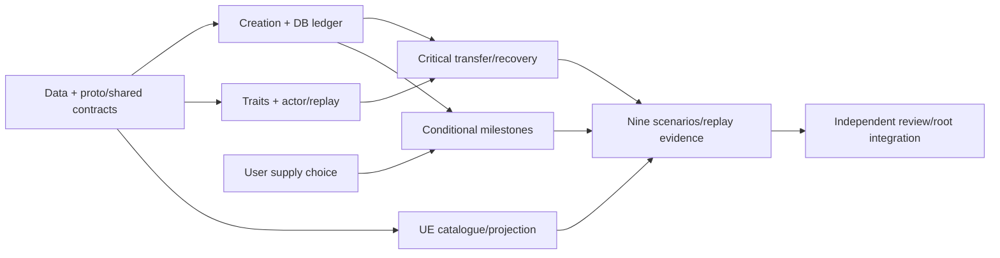

# Phase 2 Plan: Race and Class

**Status:** delivery plan 2026-10-09; data/server implementation verified; client and harness follow-ups, final live acceptance, and required token-supply choice pending (reconciled in outcome summary [`phase-2-race-and-class-outcome.md`](phase-2-race-and-class-outcome.md)). **Author:** agy gemini-3.8-flash-high; bounded revision Codex gpt-6.1-sol / high. Model/effort assignments below.

## 1. Goal and locked decisions

Deliver creation/racial identity/exact growth/learned metadata/durable transfers/Unreal presentation for **5 races** (Human, Elf, Dark Elf, Orc, Dwarf), **89 classes** (9 base/18 first/31 second/31 third), retail IDs 0..57/88..118. Preserve **cap85** (`X[86]-1`, SQL1..85) and **max playable tier2**, transfers20/40; tier3 at76 is metadata only.

- ALL production creation **(0,0)**, old0b behavior preserved; Master **(126,128), radius3** reached by normal movement. Explicit owned isolated fixture may seed **(126,126) before admission**; no teleport/new RPC/live progression edits.
- Zone is single writer; **log ack -> atomic DB checkpoint -> output/RPC success**.
- Real autoGet learning metadata in scope; manual purchase/effects Phase3 except implemented racial static modifiers.
- CP **u32/uint32**, owner-private/reserved, no absorption; initial0/derived known max, zero never full. Transfer preserves CP/HP/MP percentages with floor/alive HP min1.
- **Token SUPPLY REQUIRED USER CHOICE PENDING** (milestones/admin/other). Generic typed ledger/consumption independent; no automatic grants/backfill before choice; E4 milestones conditional.
- Proceed with curated original Nightfall display names; IDs/keys/l2_ref remain stable.
- Use existing Manny prototype bodies with one hair style/color/face at index0 and both sexes as metadata. Distinct racial/sex bodies remain an explicit art limitation, not an approval blocker.

## 2. Source authority and contracts

[Source plan 02](../planning/02-race-and-class.md) holds class references. Linked sources are integration authority, inspected on owning branches; root integrates commits, never uncommitted copies. Unimplemented extensions are **contract candidates**, not completion claims.

| Source authority | Owner / use |
|---|---|
| [game.proto](../../packages/proto/nightfall/v1/game.proto), [world.proto](../../packages/proto/nightfall/v1/world.proto) | API: additive wire definitions/tags. |
| [class.rs](../../apps/api/src/domain/class.rs), [subclass.rs](../../apps/api/src/domain/subclass.rs) | Data: registry/growth/movement/collision; existing Sex/LearnedSkill/ClassProgress/certification/eligible types. |
| [character_progression.rs](../../apps/api/src/domain/character_progression.rs) | API: identity/appearance/ClassState, complete frozen result, bounded receipts; latest source includes learned_skills/merge helper. |
| [ports.rs](../../apps/api/src/application/ports.rs), [creation use case](../../apps/api/src/application/use_cases/create_character.rs) | API: runtime/checkpoint/receipt contracts and exact fingerprint semantics. |
| [000007 SQL](../../apps/api/src/infrastructure/postgres/migrations/m20261009_000007_character_classes.sql), [wrapper](../../apps/api/src/infrastructure/postgres/migrations/m20261009_000007_character_classes.rs) | API: final schema/migration names; regenerate entities. |
| [class_data.rs](../../apps/api/src/infrastructure/class_data.rs), [data](../../packages/data) | Data: ClassSource embedded/from_dir, load_classes/load_classes_dir -> ResolvedClasses(registry, config_hash). |

### 2.1 Catalogue, stats and learning

Pin primary L2J High Five XML `3ca488dd2bd0bfaca43e378886a3c2e37968153a`; reproducible provenance. Preserve Phase1 classes/oracle; use new races/professions/growth directories. Validate five races/89 classes, 170 base-stat budget, unique IDs/keys, acyclic same-race/root parents, adjacent tiers, levels 1/20/40/76 and 85 contiguous growth rows (HP>0; MP/CP>=0; source nondecreasing). Resolve inheritance; correct Elemental Master104 parent28 and Bladedancer34 parent32.

Exact Scaled Q=1_000_000/current-class rows; nonquadratic curves forbid quadratic fits/runtime floats. **ClassDef movement/collision + sex**, including mystics, override race baselines; 32 source units/tile. Recalculate admission/level/delevel/transfer/respawn.

Human +5% XP floor/cap; Elf +3 **run only**/+3% evasion; DarkElf +5% crit damage/single-rounding/no extra RNG. Independent vectors define rounding. SP/regen/stun/weight/spoil/craft/environmental effects unavailable. Revise native Human XP expectations with independent racial oracle, retain all19 Phase1a cases; never disable live traits.

Real skill scope: **39 trees = 9 base +18 first +12 second slice IDs `2,5,8,9,12,16,17,27,33,46,52,55`**, **6,927 entries**, **3,521 proficiency rows** and **378 known skill references** spanning source levels 1..85. Report the validated actual count; other second/third trees are outside this slice. Missing required slice trees are incomplete; the remaining 50 direct trees are explicitly deferred, with available ancestor metadata inherited. Retain numeric skill_id, stable key, l2_ref, skill level, getLevel, SP, autoGet, learnedByNpc, required items; include expertise **239** and class mastery/proficiency refs. Validate references/prerequisites/duplicates/inheritance/order. Data/API finalize additive fields/projection; source comments do not override approved scope.

Create/transfer/level resolves inherited autoGet<=level into shared ClassState.learned_skills/LearnedSkill: max per key, deterministic/idempotent, **no SP charge**. Persist normalized learning/slot history/checkpoint/replay/reconnect; delevel retains it. Racial keys validated; granted_skill_keys only actual new/upgraded metadata. Effects/manual purchase Phase3 except racial modifiers; nonempty trees valid without effects. Unsupported transfer requirements fail atomically.

### 2.2 Creation and schema

**All RPCs authenticated except Ping.** Creation validates race/tier0 class, sex/index-zero appearance, 3..16 ASCII alphabetic name/configured case-insensitive blocklist; preserve display case.

Optional base_class_id presence: absent -> race fighter (Human0/Elf18/DarkElf31/Orc44/Dwarf53); explicit0 -> Human Fighter, invalid for Elf. Unspecified sex -> legacy male. Repeated TurboLink generation must retain presence. Test omitted/explicit0 separately and preserve legacy semantic retries/old fingerprint bytes using actual creation source, not a copied format; presence cannot invalidate a saved legacy default request.

Single creation transaction: account-row lock (or transaction advisory lock for a harness without account rows), lookup/claim idempotency before slot count, enforce seven, create/outbox atomically. No aggregate FOR UPDATE. Successful retry replays at seven; >7 old accounts retained but no additional creation. From six slots, distinct concurrent keys yield seven exactly; identical key/body yields one character/event. Name collision ALREADY_EXISTS; eighth RESOURCE_EXHAUSTED; key conflict FAILED_PRECONDITION.

API 000007 owns base/current class, appearance/SP/integer CP/typed counts/mask and normalized slots/certifications/receipt refs. Normalized learned-skill SQL is included in the final API schema. DB signed bounds match u32/u64. Unknown **or wrong-race** profile aborts; preserve XP/level/HP/MP/alive/position. No migration grants/backfill.

### 2.3 Transfer and critical persistence

Authenticate/validate UUID/existence/ownership, then account-scoped receipt lookup before online eligibility. Same key/body -> **complete original frozen result** offline/after later changes; different target/character under same account/key conflicts; different accounts may reuse key. Failures store nothing. **Max2 successes/character forever**, exempt24h cleanup; integer milli-tile position/all response facts frozen, never reconstructed.

ClassTransferRuntime via agreed SessionContext; API wires after start_realtime. Actor command: account/character/current **u64 generation**/UUID/target; oneshot/waiters outside domain/replay. Zone alone writes progression.

At ordered command application check identity/generation, alive, no active combat (own attack/chase/swing/cooldown or incoming engagement), fixed-point distance<=3 to Master, exact direct parent/race/root, level20/40, tier<=2 and supported token requirements. Idle selected target alone may pass. Unknown/current/sibling/third-tier/no-token/unsupported cases reject unchanged. Test squared diagonal distance and 3.000/3.001 boundary.

Success swaps growth/maxima, floors/clamps HP/MP/**CP** percentages (alive HP min1, zero old CP max ->0), updates progress/autoGet, consumes token once, drafts frozen receipt/public ClassChanged/private StatsChanged.

Single-zone account-key race: **max one NEW transfer/tick**, finish draft then second account-wide DB preflight before next. Followers replay winner; preserve eight-command order/budget/bounded queues. Cross-zone needs reservation.

Mandatory order: **immutable tick draft -> durable log ack -> revision-fenced atomic DB checkpoint (progression/class/learning/receipts/tokens/mask/outbox) -> frames/RPC success/committed epoch advance**. Transients retry identical request with backpressure/no later draft. Permanent/stale/missing lane/revision **fails closed**: no success/broadcast/epoch advance/silent recovery close. Reconcile durable prefix/lost commit ack before admission. RPC cancellation cannot cancel queued mutation; shutdown closes waiters. Same-tick level/death/transfer IDs/ordinals deterministic.

Checkpoint **Option<ClassState>**: Some full ledger; None **omits new fingerprint field/preserves migrated DB ledger**. Live ProgressionState requires identity/name/class state. Reuse Sex/ClassProgress/shared results.

### 2.4 Wire, versions and replay

| Additive surface | Locked summary |
|---|---|
| game Character | 7..14 class/root/slot/history/sex/appearance. |
| game CreateCharacterRequest | optional base5; sex6; appearance7..9. |
| game catalogue | ClassInfo source movement14/15/16; skill_tree12/proficiencies13; source metadata extensions and skill_tree_populated17 preserve existing tags. |
| world EntitySpawn | race15/class16/sex17/appearance18..20/state_tick21; public identity, no CP. |
| world StatsChanged | **uint32 CP8/maxCP9**, class10/SP11/tokens12/13/tick14; owner-private. |
| world ClassChanged | WorldEvent13: entity1/class2/tick3/generation4. |

Retain snapshots **4/5/6**, add **7**; records **3/4**, add **5**; add **BinaryV3**, preserve **BinaryV2/JsonV1 exactly**. Registry optional only in explicit old replay mode; all new live players have traits. Old decode/re-encode preserves absent fields/bytes without disk registry/new ticks. JsonV1 needs omit-absent/zero or immutable legacy view; defaults alone fail.

V3 hashes all identity/class/SP/CP/token/mask/learning/receipt/full frozen-result/order via new separator/ordered integers; excludes pointers/oneshot/checkpoint I/O. Snapshot registry/rules/Master/hash; no current disk on replay. Validate restore; share/hash registry once.

Measure actual snapshots/records (89x85 growth/6,927 learning entries/player-scale receipts) against JetStream payload limit. Coordinate separately versioned compression/adapter/root service validation; never drop metadata/receipts or treat record bounding as snapshot fix. No unvalidated NATS change.

Spawn-before-reference/current identity for late AOI/replacement/reconnect/causal owner stats; client tick/generation fences and delayed RPC cannot duplicate cues. Domain u64 must stay exact despite wire u32 saturation debt.

### 2.5 Subclass reservation

Actual `subclass::eligible(registry, context, candidate)` requires main75+ and completed second tier, **quest OR noble**, candidate tier2, <3 held subclasses; excludes Overlord/Warsmith, Elf/DarkElf crossing, same/main/held equivalent professions. Resolve tier3 held classes to tier2 ancestors per source; test every equivalence group/denial. Reserve slots1..3, four certifications/subclass (12 max), independent progress and future main-minus-five cap. Runtime switching/acquisition/certification effects/UI off.

## 3. Epics, stories, models and Done When

Models: **D = agy gemini-3.8-flash-high**, **C = Codex gpt-6.1-sol / high**, **Z = Codex gpt-6-astra / high**; Z reviews critical contracts independently. Rows specify work and acceptance conditions; verified and pending gates are recorded in the outcome summary.

### E1 — Race/class data and traits

| Story | Work / Done When | Model |
|---|---|---|
| 1.1 Source catalogue | Generate 5 races/89 classes/exact 85-row growth with pinned provenance; reproduce goldens, preserve Phase 1 data and production `(0,0)`. | D |
| 1.2 Loader/registry | Validate stats/tree/refs/inheritance/hash; malformed/cyclic/race/tier/growth fail startup; reordered inputs keep hash. | D |
| 1.3 Learning metadata [client-visible] | Deliver 39 trees/6,927 learning rows and expertise/mastery refs; report count; inherited create/level/transfer merge persists maximum levels, charges no SP and returns actual grant keys. | D |
| 1.4 Subclass rules | Reuse `eligible`/reservation types; test level/tier, quest-or-noble, forbidden/cross-race/main/held/equivalent and slot/certification limits; runtime off. | D |
| 1.5 Racial stats/CP [client-visible] | Current-class growth/movement/collision and three racial effects; independent vectors prove reserved zero CP/percentages without absorption. | Z |
| 1.6 Simulation scenario(s) [client-visible] | `2-racial-traits.nfs` covers 1.5 and observable 1.3 metadata; client stats match independent oracle, effects availability is truthful. | C |

### E2 — Creation and persistence

| Story | Work / Done When | Model |
|---|---|---|
| 2.1 Wire [client-visible] | Additive fields/auth catalogue/metadata and repeatable bindings; compatibility round-trips retain optional explicit ID0. | C |
| 2.2 Schema/name validation [client-visible] | Race/root/sex/appearance/blocklist; name 2/3/16/17 boundaries, charset/case and UI errors asserted. | D |
| 2.3 Atomic creation [client-visible] | Serialize accounts, preserve legacy retries, seven slots/outbox; Postgres distinct-key six-to-seven and identical-key one-write/event plus read-after-write pass. | C |
| 2.4 Migration/backfill [client-visible] | Final API 000007/normalized learning/generated entities; unknown/wrong-race abort, old XP/level/vitals/position unchanged and migrated client identity correct. | C |
| 2.5 Simulation scenario(s) [client-visible] | `2-create-each-race-class-01.nfs`, `2-create-each-race-class-02.nfs`, `2-create-each-race-class-03.nfs` cover 2.1..2.4 across accounts: 5 races/9 roots, stats/metadata/errors/seven slots. | C |

### E3 — Zone transfer and durability

| Story | Work / Done When | Model |
|---|---|---|
| 3.1 State machine [client-visible] | Actor guards/account/generation, bounded order, one-new-transfer/tick/preflight; rejection leaves state/tokens/keys unchanged and races pass. | Z |
| 3.2 Growth/learning [client-visible] | Swap class/progress, floor HP/MP/CP percentages, alive HP min1, inherited learning; zero/full/clamp/learned-key and later level/delevel vectors pass. | Z |
| 3.3 Events/AOI [client-visible] | Public ClassChanged/private CP stats/current spawn identity; owner/observer/late-AOI/replacement/stale projection tests pass. | Z |
| 3.4 Critical checkpoint | Log ack -> atomic ledger/receipts/tokens/outbox -> release; duplicates/offline full replies/lost commit or RPC ack prove one effect and two permanent receipts. | C |
| 3.5 Recovery/fences | Recover before admission, legacy None preservation, fail-closed lanes; midtick/log-before-DB/stale/missing/replacement cases cannot advance failed epoch. | C |
| 3.6 Simulation scenario(s) [client-visible] | `2-class-transfer.nfs`, `2-class-transfer-rejected.nfs`, `2-class-transfer-observer-a.nfs`, `2-class-transfer-observer-b.nfs`, `2-class-transfer-reconnect.nfs` cover 3.1..3.3: 20/40 paths, guards, observers/persistence; export replay. | C |

### E4 — Token bridge (milestone supply conditional)

| Story | Work / Done When | Model |
|---|---|---|
| 4.1 Milestones [client-visible, conditional] | Only after choice: once-ever true 20/40 crossing grants/critical checkpoint; single/multilevel crossings and chosen backfill tested. | C |
| 4.2 Generic consumption [client-visible] | Independently consume typed tokens/counts; seeded balance consumed once, missing requirement rejects atomically without implied supply. | C |
| 4.3 Delevel protection [conditional] | Durable counts/mask; 20->19->20, 40->39->40, both-crossing jumps/retry/recovery cannot duplicate grants. | C |
| 4.4 Simulation scenario(s) [client-visible] | `2-class-transfer.nfs` covers 4.2; if milestones chosen, unit/native fixtures assert real 20/40 crossings for 4.1/4.3 separately from seeded consumption. | C |

### E5 — Unreal presentation

| Story | Work / Done When | Model |
|---|---|---|
| 5.1 Creation UI [client-visible] | Race/root/sex metadata, index-zero appearance/stat preview/truthful Manny; widget/payload/error/cook checks pass, prototype art limitation is documented. | C |
| 5.2 Catalogue/tree [client-visible] | Auth/cache/hierarchy/skills/proficiencies/unavailable effects/tier3; parent/current/available/unmet projections verified. | C |
| 5.3 Master workflow [client-visible] | Location/range/ordinary travel/options/confirm/retry; errors/delayed/offline replies and commit-gated success verified. | C |
| 5.4 HUD/projection [client-visible] | CP/SP/tokens/class/title/cue and tick/generation fences; zero CP/binary frames/stale/late-AOI/duplicate RPC yield correct single presentation. | C |
| 5.5 Simulation scenario(s) [client-visible] | Creation three + transfer/rejected/observer-a/observer-b/reconnect five + `2-racial-traits.nfs` = nine fixed files cover 5.1..5.4; measured assertions/logs/replays and paired observers pass. | C |

### E6 — Replay, evidence and docs

| Story | Work / Done When | Model |
|---|---|---|
| 6.1 Replay | New snapshot7/record5/BinaryV3 transfer capture; exact legacy/new state/output, corruption and side-effect-free verifier tests pass; payload measured. | C |
| 6.2 Telemetry | Outcomes/latency/stalls/policy-enabled grants; instrumentation/dashboard verified without PII/identity labels or fake grants. | D |
| 6.3 Diagrams | Offline tree/transfer diagrams render/link and preserve final contracts/durability order. | D |
| 6.4 Docs | Source-plan/architecture/decisions match code, counts, choices/limits and actual evidence under independent review. | D |

## 4. Required test matrix and fixtures

Owners run domain/socket/DB checks; this revision checks only the plan.

| Surface | Required assertions |
|---|---|
| ListClasses | Auth rejection/real gRPC round-trip; five races/89 classes/hash/parents/cap/tier/Master/movement/real metadata/availability. Ownership, slots and mutation keys inapplicable to catalogue. |
| Creation | Auth/malformed UUID/input/race/root/sex/appearance/name/collision/eighth slot; same-key semantic retry/conflict/read-after-write create-get-list; omitted Human/Elf vs explicit0. |
| TransferOptions | Auth/malformed UUID/NotFound/ownership/no-live/unavailable; current state/direct children/unmet guards/third-tier refusal. No mutation key. |
| ChangeClass | Auth/malformed UUID/key/target/**NotFound**/ownership/no-live/unavailable/all guards; conflict/duplicate/offline frozen full response; committed read-after-write. Slots tested in creation. |
| Postgres | Distinct keys from six slots -> seven; identical key -> one write/event; legacy key/fingerprint goldens; old >7 accounts preserved; migration unchanged progression/unknown+wrong-race abort; atomic class/skills/token/receipt/outbox rollback. |
| Binary WS/UI | All new fields round-trip incl zero class/CP/tick; owner privacy/AOI/spawn-before-reference/late AOI/reconnect; stale/late tick/generation class projection and delayed duplicate RPC cue. |
| Domain | Growth1..85/inheritance/refs/max learning; levels19/20/39/40/76/85; distance center/diagonal/3.000/3.001; alive/combat/race/parent/tokens; resource floors/clamps; independent racial/subclass oracles. |
| Actor | Same-key followers one effect; different-body conflict/sibling-key race; account-key cross-character conflict/different-account reuse; replace/despawn/cancel/overload/order/budget; exact u64 fence above wire max. |
| Failure/recovery | Withheld log ack no DB/output; transient DB failure identical request; stale/permanent/missing lane no success/epoch advance; lost commit/RPC ack/offline retry; same-tick level/death/transfer; midtick restore before/after save; log-before-DB recovery before admission commits receipt/token/outbox once. |
| Replay | Snapshot4/5/6, record3/4 exact decode/re-encode; old JsonV1/BinaryV2/checkpoint fingerprint goldens and recorded fixtures; new V3 bytes/state/output; no verifier DB effects; missing baseline/gap/version/corruption fails; real payload limit measured. |

Preserve **19 Phase1a cases**; revise Human native XP via independent racial oracle. Legacy mode only for recordings, never live trait masking. Run appropriate proto/build/entity/fmt/clippy/tests; no fake CI/native results. After the final Phase2 and legacy suites, stage the current packaged Game and run one eight-client 20-minute combat soak against the same final source. Record tick p99 against the existing <20ms budget on a quiescent host (no concurrent builds/tests). The bounded 200-player idle/digest measurement is supporting evidence, not the combat gate; do not reuse the old staged Phase1a binary.

**Nine required scenario files:** creation `2-create-each-race-class-01.nfs`, `2-create-each-race-class-02.nfs`, `2-create-each-race-class-03.nfs`; `2-racial-traits.nfs`; `2-class-transfer.nfs`, `2-class-transfer-rejected.nfs`, `2-class-transfer-observer-a.nfs`, `2-class-transfer-observer-b.nfs`, `2-class-transfer-reconnect.nfs`. Only observer `-a/-b` files pair; creation `-01/-02/-03` are independent CI units. Additional invalid-creation and missing-token scenarios strengthen the negative cases.

Normal run-sim/run-sim-multi/CI discovery recognizes explicit `# fixture: phase2-transfer`, `phase2-transfer-observer` and `phase2-transfer-missing-token` headers. The harness provisions an isolated fresh database, migrates and seeds before API startup, assigns distinct role accounts, exports evidence and cleans up only its owned stack. Attached APIs cannot accept a mutation fixture. Legacy scenario behavior stays unchanged.

Coordinator serializes native/Compose runs. Fixture requires AUTH_DEV_TOKENS=1, recognized explicit pack/owned isolated DB marker; refuse wrong DB/unexpected receipts/revision/admitted player. API creates UUID manifest; bound final-schema SQL seeds authoritative XP/class/vitals/tokens/mask and **126,126 before tickets/admission**. No root.env/live edits/production spawn changes; no credentials logged.

Assert true20/40 parent paths, consumption/maxima/real learning/receipt/outbox/observer/reconnect. Reject19/39, third76/85, no token/far/dead/combat/wrong root/parent. Seeded balances prove consumption only; chosen milestones need real crossing unit/native fixtures. Lost response: disconnect after commit, retry offline for full equality. Crash tests use disposable DB/adapters.

## 5. Dependencies and integration

Waves gate dependencies: foundations -> independent creation/schema, zone and UE work on CLI-owned branches -> ports/durability/failure/legacy/payload checks -> coordinator native evidence. Consumption independent of supply; milestones wait. Independent critical review then root direct integration under user method; no PR/invented timings. Commit owned files; root controls shared-stack runs.

## 6. Risks

- Source drift/nonlinear growth: pinned provenance, explicit rows, validated count/refs and independent oracle.
- Log/DB split or stale/missing lane: retained immutable critical request, fail closed, lost-ack recovery before admission/output.
- Account-key race: one new transfer/tick plus second preflight/permanent DB uniqueness; cross-zone needs reservation.
- Snapshot growth: measure actual JetStream payload; coordinate versioned compression, retain all data.
- Legacy drift: golden bytes/fingerprints and None checkpoint preserve migrated ledger.
- Token exploits/pending policy: required supply/backfill choice and conditional durable once-ever bits.
- Art/effect overstatement: truthful index-zero Manny/sex metadata and unavailable skills; no claim of distinct racial/sex art assets.
- External gates: CI runner **unregistered**, **two-week reliability gate pending** separately from local Phase2 acceptance; no fresh 14-day wait is required to integrate reviewed features. Existing Phase1a eight-client 20-minute soak evidence completed; Phase2 needs new actual local regression measurements.

## 7. Out of scope

Manual SP purchase/skill execution/buffs Phase3; inventory/equipment/mastery effects Phase4; economy Phase5; quests Phase6; playable tier3/subclass runtime/certification effects/UI; Kamael/multiple-zone/geodata/swimming. Real autoGet/proficiency metadata/racial modifiers in scope. No teleport/mutable progression RPC/fake results.

## 8. Outcome reconciliation

- [x] Catalogue/growth/39 real trees/count/refs/source provenance verified (13 Rust + 3 Python tests pass, independent admission reviews APPROVE `4adde1e`).
- [ ] Required token supply/backfill choice recorded; no premature grants. Curated names and prototype art are documented implementation assumptions. (Token choice STILL PENDING; consumption verified).
- [x] Production `(0,0)` and fixture `(126,126)` spawn, cap 85, tier 2 playable, Master `(126,128)` radius 3 verified in contracts and test gates.
- [x] Creation/concurrency/legacy retries/migration preservation/normalized learning verified (`grpc_create_character15`, Postgres concurrent bounded 7, all 9 profiles preserved at 85/XP/position).
- [x] Independent racial/class/CP vectors and actual learned keys verified (397 lib tests, exact CON max CP floor, living HP min 1, Human XP, Elf run/evasion, DE crit).
- [x] Actor/account-key/permanent frozen receipts/log->DB->output/fail-closed recovery proven (38 functional suites / 642 pass with real DB 26432 & NATS 25422; runtime review `8edffd1` PASS).
- [x] Old/new snapshots/records/digests/fingerprints and payload limits verified (BinaryV3 snapshot 2,060,904 -> 152,362 bytes; prost catalogue 455,324 bytes; codec `a8ac679` & outer NFR `5b6861b` PASS).
- [ ] E1..E5 simulations: 11 Phase 2 `.nfs` files authored at candidate `9f3927d`; an explicit-key historical retry scenario is being added. Initial client Game/Editor builds and 62 editor tests passed (4 offline cases skipped); later required-live automation passed 62/62 without skips at `889af68`. Additional automation cases and ordinary wrapper execution remain pending.
- [ ] All 19 Phase 1a baseline intents retained; intentional Human XP expectations updated; fresh live verification across all 19 cases PENDING.
- [ ] Performance & soak: release combat p99 gate remains pending; documented optimized cargo bench on quiescent host PASS (NPC mean 0.143ms < 2ms, 1000 observers mean 5.087ms < 10ms); debug all-target run failed NPC mean 3.091ms; final packaged 8-client 20-min combat soak PENDING.
- [ ] External gates: CI runner unregistered; external two-week reliability programme separate; final root checkout Game/Editor rebuild required post-merge.

Detailed verification metrics, evidence receipts, and open gates are documented in [`phase-2-race-and-class-outcome.md`](phase-2-race-and-class-outcome.md). Final acceptance remains pending until the product decision and required live gates are resolved.
